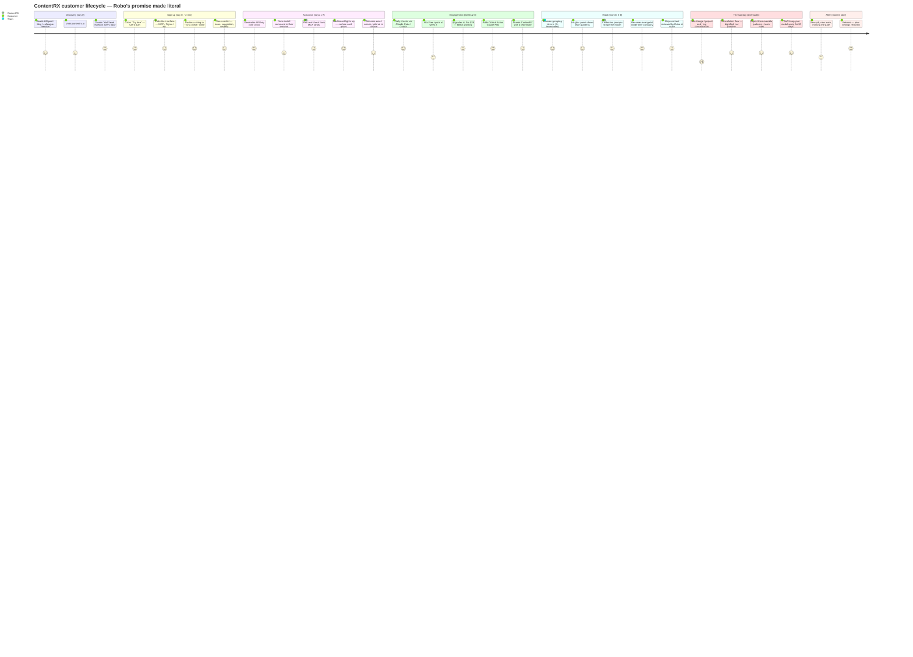
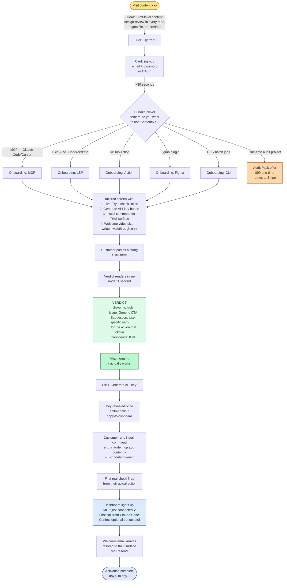
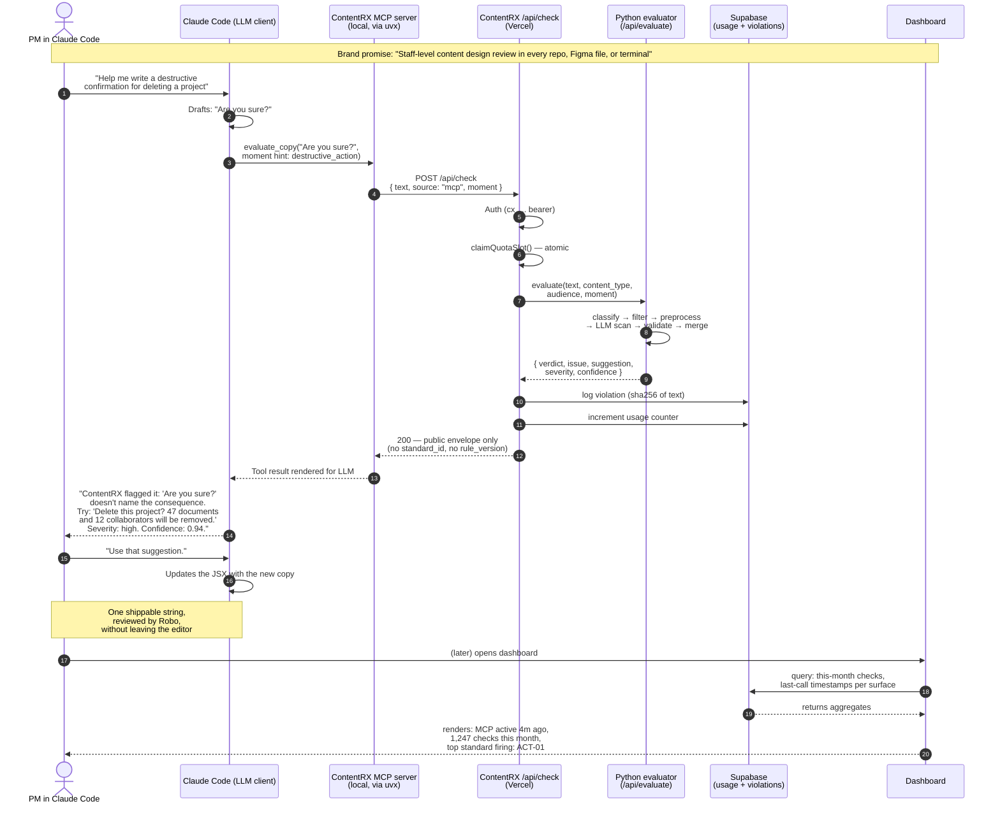
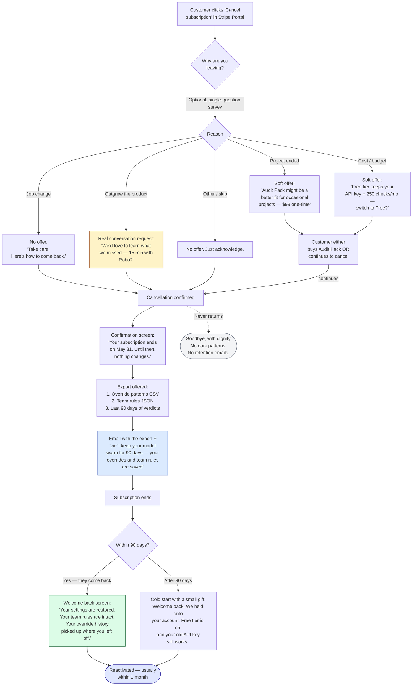

# ContentRX customer journey — diagrams

**Brand promise (threaded through every diagram below):**
> ContentRX — staff-level content design review in every repo, Figma file, or terminal.

Six diagrams, in order:
1. The full lifecycle (satisfaction arc from signup to graceful exit)
2. Signup → first check (the activation flow with UI annotations)
3. The MCP check loop (sequence: human → Claude Code → ContentRX → shipped string)
4. Shipping at scale (how one check becomes a team practice)
5. Dashboard UI states (ASCII mockups at each lifecycle stage)
6. The sad day (graceful cancellation + reactivation path)

All diagrams render natively in GitHub, GitLab, VS Code, Obsidian, and most markdown viewers. The ASCII dashboard mockups render anywhere.

---

## 1. The full lifecycle — satisfaction arc



The arc has only three real dips: hitting the Free quota, the eventual cancellation, and missing the product after they've left. **None of those should land at a 1 or 2 if the experience is designed well.** Every dip has a corresponding designed recovery: the quota wall has the upgrade path; the cancellation has the export and the warm-model promise; the post-cancel return has the restored-settings welcome-back.

---

## 2. Signup → first check — the activation flow

The single most important 5 minutes of the customer's life with ContentRX. Every UI element below earns its place by reducing time-to-first-verdict or making the verdict feel like the brand promise made literal.



**Why this design works:**

| UI element | Why it earns its place |
|---|---|
| Hero copy = brand promise verbatim | The hero is what they remember 6 hours later. Make it the promise. |
| Surface picker as first post-signup screen | Routes audit users to the Audit Pack offer (saves them from a Pro cancellation). Routes integration users to tailored install. |
| "Try a check" inline before install | Stripe-style: touch the product before wiring it up. Eliminates the "is this real?" question. |
| Verdict format — issue + suggestion + severity + confidence | Matches the public envelope (per ADR). No standard IDs leak. The customer feels a *judgment*, not a vibe. |
| One-click API key reveal (amber callout, "copy now, won't show again") | Mirrors the existing implementation. Zero friction. |
| Tailored install command for *their* surface only | They don't see 5 install patterns; they see 1. Cuts decision fatigue. |
| Dashboard lights up on first real call | This is the moment that turns "I installed something" into "I have a thing." Worth real engineering effort. |
| Welcome email after first call (not after signup) | Email lands when they're ready to read it — having actually used the product, not just signed up. |

---

## 3. The MCP check loop — sequence diagram

This is the value loop. The brand promise made literal, one string at a time. Every subsequent diagram in this file is some elaboration on this core interaction.



**The crucial property of this loop:** the customer *never opens a browser*. The verdict appears in their LLM client, which is where they were already working. ContentRX is not a destination — it's an inline review.

**What the LLM client narrates is what the customer hears.** Get the narration shape right, and the brand promise lands every single check. Get it wrong, and customers feel like they're talking to a checker rather than a colleague. The sample line in step 12 above is the model:

> *"ContentRX flagged it: 'Are you sure?' doesn't name the consequence. Try: 'Delete this project? 47 documents and 12 collaborators will be removed.' Severity: high. Confidence: 0.94."*

Specific. Sourced. Names the issue. Provides the rewrite. Includes the confidence so the customer can decide how much weight to give it. No standard IDs leaked. No moment names exposed. Reads like a colleague who just glanced at the screen.

---

## 4. Shipping at scale — how one check becomes a team practice

This is where the moat shows up in customer experience. A single check is a feature; a team's accumulated overrides becoming the team's content design standard is the product.

```mermaid
flowchart TD
    A[1 PM uses ContentRX in MCP<br/>~50 checks/week] --> B{After 4 weeks,<br/>what happens?}

    B -->|Pattern recognition| C[PM internalizes the standards<br/>writes better first drafts]
    B -->|Aha moment| D["PM shows their team:<br/>'I shipped this flow<br/>without a content review<br/>and it's all clean'"]

    C --> E[1 PM ships better content<br/>~30% fewer copy revisions<br/>in design reviews]

    D --> F[2nd teammate signs up<br/>same email domain]
    F --> G[3rd teammate signs up]

    G --> H[Domain-grouping triggers:<br/>1 invoice<br/>team-level dashboard views]

    H --> I[Team-level patterns surface:<br/>'Standard ACT-01 fires 47x/week<br/>across team, 80% accepted'<br/>'Standard VT-05 overridden<br/>5 of 8 times — consider<br/>disabling']

    I --> J[Team admin disables VT-05<br/>in team rules]
    J --> K[Future checks reflect<br/>team's calibrated judgment]

    K --> L["Team's overrides<br/>feed back into calibration<br/>(per refinement-log architecture)"]

    L --> M[Robo's weekly review<br/>incorporates the override stream]

    M --> N[Model gets sharper for<br/>this team specifically AND<br/>all teams generally]

    N --> O[Compounding moat:<br/>Every week the model reflects<br/>more of the team's house style<br/>without anyone writing rules]

    O --> P([Team ships content<br/>reviewed by Robo at scale<br/>~thousands of strings/month])

%% [Updated 2026-04-27: per-team model adaptation deferred. Today the
%% model adapts to a team via team_rules + custom_examples (direct,
%% instant) and via Robo's global calibration loop (indirect, slow).
%% Per-team ML fine-tuning is on the post-launch roadmap, not the
%% launch SKU — pending customer-data validation that the demand is
%% real. Don't ship marketing copy that claims "the model gets sharper
%% for this team specifically" until the feature exists.]

    P --> Q[Brand promise delivered:<br/>'staff-level content design review<br/>in every repo, Figma file, or terminal']

    style A fill:#fde68a,stroke:#92400e
    style D fill:#dbeafe,stroke:#1e40af
    style H fill:#bbf7d0,stroke:#166534
    style O fill:#fce7f3,stroke:#9d174d
    style Q fill:#e0e7ff,stroke:#3730a3
```



**The compounding loop in plain language:**

1. One PM gets value → ships better individual flows.
2. They show a teammate → second user.
3. Second user shows another → third user.
4. Three users from the same domain → team-grouping kicks in automatically (no purchase decision required).
5. Team-level patterns become visible in the dashboard.
6. Team admin tunes the rules → ContentRX now reflects this team's house style.
7. The team's overrides feed back into Robo's calibration loop.
8. The model gets sharper for this team specifically and all teams generally.
9. The team is now shipping thousands of strings/month, all reviewed by Robo at scale.

**The brand promise made literal at scale:** one PM's $29/mo turns into a team's de facto content design standard. That's the moat — not a feature any competitor can ship, because it's built from the team's accumulated judgment over time.

---

## 5. Dashboard UI states — ASCII mockups at each lifecycle stage

The dashboard is not the verdict surface (that's MCP/LSP/PR/Figma). The dashboard is the **integration health, learning, and management surface**. It looks different at each lifecycle stage.

### Stage 1: Day 0 — just signed up, no API key, zero checks

```
┌──────────────────────────────────────────────────────────────────┐
│  ContentRX                                          robo@xx.com  │
│                                                       [Sign out] │
├──────────────────────────────────────────────────────────────────┤
│                                                                  │
│   Welcome to ContentRX. Try a check before you install.          │
│                                                                  │
│   ╭────────────────────────────────────────────────────────╮     │
│   │  Try a check                                           │     │
│   │  ┌──────────────────────────────────────────────────┐ │     │
│   │  │ Click here                                       │ │     │
│   │  └──────────────────────────────────────────────────┘ │     │
│   │  Content type: ▾ button label                          │     │
│   │  [Check it →]                                          │     │
│   ╰────────────────────────────────────────────────────────╯     │
│                                                                  │
│   ╭───────────────────╮  ╭───────────────────╮                  │
│   │ Your API key      │  │ Free plan         │                  │
│   │                   │  │                   │                  │
│   │ Not generated yet │  │ 0 / 250 checks    │                  │
│   │                   │  │ ▱▱▱▱▱▱▱▱▱▱        │                  │
│   │ [Generate key]    │  │ Resets May 1      │                  │
│   ╰───────────────────╯  ╰───────────────────╯                  │
│                                                                  │
│   Surfaces — pick the one you'll use first                       │
│   ╭─────────╮ ╭─────────╮ ╭─────────╮ ╭──────────╮ ╭────────╮  │
│   │   MCP   │ │   LSP   │ │ Action  │ │  Figma   │ │  CLI   │  │
│   │         │ │         │ │         │ │          │ │        │  │
│   │ ○       │ │ ○       │ │ ○       │ │ ○        │ │ ○      │  │
│   │ Install │ │ Install │ │ Install │ │ Install  │ │ Install│  │
│   ╰─────────╯ ╰─────────╯ ╰─────────╯ ╰──────────╯ ╰────────╯  │
│                                                                  │
└──────────────────────────────────────────────────────────────────┘
```

**Key elements:** Try-a-check is the hero, not the API key panel. Surface cards are dim ("○") because nothing's connected yet. The empty quota shows "0 / 250" with a clear reset date.

### Stage 2: Day 1 — first check landed via MCP

```
┌──────────────────────────────────────────────────────────────────┐
│  ContentRX                                          robo@xx.com  │
├──────────────────────────────────────────────────────────────────┤
│                                                                  │
│   ✓ MCP just connected. First call from Claude Code landed.      │
│                                                                  │
│   ╭────────────────────────────────────────────────────────╮     │
│   │  Try a check                          [paste another]  │     │
│   ╰────────────────────────────────────────────────────────╯     │
│                                                                  │
│   ╭───────────────────╮  ╭───────────────────╮                  │
│   │ Your API key      │  │ Free plan         │                  │
│   │ cx_a1b2c3...   ✓  │  │ 1 / 250 checks    │                  │
│   │ Created 2 min ago │  │ ▰▱▱▱▱▱▱▱▱▱        │                  │
│   │ [Rotate]  [Revoke]│  │ Resets May 1      │                  │
│   ╰───────────────────╯  ╰───────────────────╯                  │
│                                                                  │
│   Active surfaces                                                │
│   ╭─────────╮ ╭─────────╮ ╭─────────╮ ╭──────────╮ ╭────────╮  │
│   │   MCP   │ │   LSP   │ │ Action  │ │  Figma   │ │  CLI   │  │
│   │ ● now   │ │ ○       │ │ ○       │ │ ○        │ │ ○      │  │
│   │ 1 ✓     │ │ Install │ │ Install │ │ Install  │ │ Install│  │
│   ╰─────────╯ ╰─────────╯ ╰─────────╯ ╰──────────╯ ╰────────╯  │
│                                                                  │
│   Your first verdict (1 minute ago, via MCP)                     │
│   ╭────────────────────────────────────────────────────────╮     │
│   │ "Are you sure?"                                        │     │
│   │ ⬤ Violation · severity: high · confidence: 0.94       │     │
│   │                                                        │     │
│   │ Issue: Destructive confirmation doesn't name the      │     │
│   │ consequence.                                           │     │
│   │ Suggestion: "Delete this project? 47 documents and   │     │
│   │ 12 collaborators will be removed."                    │     │
│   ╰────────────────────────────────────────────────────────╯     │
│                                                                  │
└──────────────────────────────────────────────────────────────────┘
```

**Key elements:** Banner confirms the integration is live. MCP card glows "● now" with a check count. The first verdict is shown — proof the brand promise just delivered. Customer leaves the dashboard knowing it works.

### Stage 3: Week 6 — Pro tier, daily use, multiple surfaces

```
┌──────────────────────────────────────────────────────────────────┐
│  ContentRX                                          robo@xx.com  │
│                                                            [Pro] │
├──────────────────────────────────────────────────────────────────┤
│                                                                  │
│   ╭────────────────────────────────────────────────────────╮     │
│   │  Try a check                                           │     │
│   ╰────────────────────────────────────────────────────────╯     │
│                                                                  │
│   ╭───────────────────╮  ╭───────────────────╮                  │
│   │ Your API key      │  │ This month        │                  │
│   │ cx_a1b2c3...   ✓  │  │ 1,847 / 5,000     │                  │
│   │                   │  │ ▰▰▰▰▱▱▱▱▱▱  37%   │                  │
│   │ [Rotate]  [Revoke]│  │ Renews May 1      │                  │
│   ╰───────────────────╯  ╰───────────────────╯                  │
│                                                                  │
│   Active surfaces                                                │
│   ╭─────────╮ ╭─────────╮ ╭─────────╮ ╭──────────╮ ╭────────╮  │
│   │   MCP   │ │   LSP   │ │ Action  │ │  Figma   │ │  CLI   │  │
│   │ ● 4m    │ │ ● 12m   │ │ ● 1h    │ │ ● 3d     │ │ ○      │  │
│   │ 924 ✓   │ │ 612 ✓   │ │ 287 ✓   │ │ 24 ✓     │ │ Install│  │
│   ╰─────────╯ ╰─────────╯ ╰─────────╯ ╰──────────╯ ╰────────╯  │
│                                                                  │
│   This week — what the model is telling you                      │
│   ╭────────────────────────────────────────────────────────╮     │
│   │ ▸ 47 violations · 12 review-recommended · 388 passes  │     │
│   │ ▸ Top firing: ACT-01 (generic verbs) — 18×            │     │
│   │ ▸ Most overridden: VT-05 — you dismissed 5 of 8       │     │
│   │   Consider tuning VT-05 in team rules.                │     │
│   │ ▸ Pattern: 4 destructive confirmations missing the    │     │
│   │   consequence. Heads up — possible team blind spot.   │     │
│   │                                              [More →] │     │
│   ╰────────────────────────────────────────────────────────╯     │
│                                                                  │
│   Subscription · Pro $29/mo · [Manage in Stripe →]               │
│                                                                  │
└──────────────────────────────────────────────────────────────────┘
```

**Key elements:** Active surfaces row shows the customer's whole world. Insights panel surfaces patterns the customer can't see from any single surface. The "possible team blind spot" callout is the moat showing up: this is the kind of observation only ContentRX can make, because only ContentRX sees every check across every surface.

### Stage 4: Month 4 — domain-grouping kicked in (3+ teammates)

```
┌──────────────────────────────────────────────────────────────────┐
│  ContentRX                                          robo@xx.com  │
│                                              [Pro · Team domain] │
├──────────────────────────────────────────────────────────────────┤
│                                                                  │
│   ╭────────────────────────────────────────────────────────╮     │
│   │  Try a check                                           │     │
│   ╰────────────────────────────────────────────────────────╯     │
│                                                                  │
│   Your team @xx.com — 4 active members                           │
│   ╭────────────────────────────────────────────────────────╮     │
│   │ robo (admin) · 1,847 checks · MCP, LSP, Action         │     │
│   │ alex          · 423 checks   · MCP                     │     │
│   │ sam           · 1,201 checks · Action                  │     │
│   │ priya         · 89 checks    · Figma                   │     │
│   │                                          [Manage →]    │     │
│   ╰────────────────────────────────────────────────────────╯     │
│                                                                  │
│   This month · team total                                        │
│   ╭───────────────────╮  ╭───────────────────╮                  │
│   │ 3,560 / 20,000    │  │ 4 invoices →      │                  │
│   │ ▰▰▰▱▱▱▱▱▱▱  18%   │  │ rolled into 1     │                  │
│   │ Pooled across team│  │ 10% domain coupon │                  │
│   ╰───────────────────╯  ╰───────────────────╯                  │
│                                                                  │
│   Team patterns this week                                        │
│   ╭────────────────────────────────────────────────────────╮     │
│   │ ▸ Most-disagreed standard across team: VT-05 (12 of 19)│     │
│   │   Looks like your team has a different take on this    │     │
│   │   than the model. Want to disable it team-wide?        │     │
│   │   [Open team rules →]                                  │     │
│   │                                                        │     │
│   │ ▸ priya (Figma): 2 destructive confirmations missing  │     │
│   │   the consequence — same pattern Robo flagged in       │     │
│   │   sam's PR last week. Worth a sync?                    │     │
│   ╰────────────────────────────────────────────────────────╯     │
│                                                                  │
└──────────────────────────────────────────────────────────────────┘
```

**Key elements:** Team-level views activate without anyone making a "team purchase decision." The cross-member pattern callout (priya in Figma + sam in PR) is something no individual surface could see — it's only visible because ContentRX has the cross-surface vantage point.

### Stage 5: Cancellation flow — see diagram 6 below

---

## 6. The sad day — graceful cancellation + reactivation

> **[Updated 2026-04-27]:** The "we'll keep your model warm for 90 days" language below was retired in favor of *"your team setup stays put for 90 days"* — there is no per-team ML model to "warm." What persists is the customer's configuration (team_rules, custom_examples), their override history, and their API key. Retention pattern: pseudonymize at 90 days post-cancel (matches existing audit H-08 / GDPR pattern), so personal attribution drops while anonymized signal continues to feed engine calibration. See revised PR-29/30/31 specs.

The cancellation moment is when the brand either becomes a "they treated me well" memory or a "good riddance" memory. The first kind comes back. The second doesn't. Design for the first kind.



**The principles behind the cancellation experience:**

| Principle | What it means in practice |
|---|---|
| **The exit interview is one question** | Not 10. One. Their time matters. |
| **The right offer based on the reason** | "Project ended" → Audit Pack. "Cost" → Free tier. "Job change" → no offer, just dignity. The pitch matches the actual problem. |
| **No dark patterns** | No buried cancel button. No 5-step confirmation flow. No "are you SURE you want to leave?" three times. |
| **The model stays warm for 90 days** | Their overrides, team rules, and API key persist. Coming back is one click, not a full restart. |
| **The export matters** | Customers who feel they own their data come back. Customers who feel trapped in your data don't. The export is a *brand statement*. |
| **The "we'll keep it warm" email is a brand asset** | This is what they remember. This is what they tell colleagues. Spend real copy effort here. |
| **No retention emails after cancellation** | One welcome-back-when-you're-ready note at month 6, then silence. Stalking customers is bad form. |

### Sample cancellation confirmation copy

```
─────────────────────────────────────────────────────────────────
  Subscription canceled

  Your Pro subscription ends May 31. Until then, nothing changes —
  you keep all 5,000 checks for the rest of the month.

  After May 31, your account drops to the Free tier (250 checks/mo).
  Your API key still works. Your team rules and override history
  stay put for 90 days — if you come back before August 29, your
  setup picks up where it left off.

  Export your data:
    [ Download override patterns (.csv) ]
    [ Download team rules (.json) ]
    [ Download last 90 days of verdicts (.json) ]

  We'd love to know why if you have a minute:
    ○ Project ended
    ○ Cost / budget
    ○ Job change
    ○ Outgrew the product
    ○ Other
    [ skip ]

  Take care. — Robo
─────────────────────────────────────────────────────────────────
```

The signature on the cancellation screen is **Robo**, not "the team" or "ContentRX." Named-expert positioning carries through to the exit. This is the small thing that turns a cancellation into a story the customer tells.

---

## How the brand promise threads through every diagram

A summary of where "staff-level content design review in every repo, Figma file, or terminal" shows up:

| Diagram | Where the promise lands |
|---|---|
| **#1 Lifecycle** | The hero copy at signup is the promise verbatim. Every "5: Customer" peak in the satisfaction journey is the promise being delivered. |
| **#2 Activation** | Surface picker turns "in every repo, Figma file, or terminal" into the customer's literal first decision: pick yours. The first verdict at minute 2 makes "staff-level review" a felt experience, not a tagline. |
| **#3 MCP loop** | The narration in step 12 *is* the promise made literal: a senior content designer's reflexive read on a string, in the editor, in under a second. |
| **#4 Shipping at scale** | The team-pattern callout ("possible team blind spot") is what "staff-level review" looks like at team scale — observations no individual surface can make. |
| **#5 Dashboard mockups** | Every state shows surface-level activity ("● MCP 4m ago, 924 checks ✓") — proof the promise is being delivered across the customer's actual stack. |
| **#6 Cancellation** | The promise honored even at exit: "we'll keep your model warm." The named-expert sign-off (Robo) is the promise carried through to the last touchpoint. |

---

## What to ship in week 1 vs. iterate later

If you ship the absolute minimum to deliver the journey above, the priority order is:

**Week 1 (must ship for activation to work):**
1. Surface picker as post-signup screen ([PR-18](./pricing-and-unit-of-value-strategy-2026-04-26.md))
2. "Try a check" inline panel on the dashboard ([PR-16](./pricing-and-unit-of-value-strategy-2026-04-26.md))
3. Active surfaces row with last-call timestamps ([PR-17](./pricing-and-unit-of-value-strategy-2026-04-26.md))
4. "First call from MCP just landed" notification on dashboard
5. Welcome email triggered on first real check (not on signup) ([PR-24](./pricing-and-unit-of-value-strategy-2026-04-26.md))

**Week 2-3 (must ship for habit to form):**
6. Insights panel ([PR-19](./pricing-and-unit-of-value-strategy-2026-04-26.md))
7. Override-pattern emails / team blind-spot callouts
8. Domain-grouping detection ([PR-21](./pricing-and-unit-of-value-strategy-2026-04-26.md))

**Week 4+ (must ship before first cancellation):**
9. Cancellation flow with one-question survey
10. Export endpoints (overrides CSV, team rules JSON, verdicts JSON)
11. "We'll keep your model warm for 90 days" email
12. Welcome-back-with-restored-settings flow

The cancellation flow is item #9, but it must ship *before* the first paying customer hits month 1 — because somebody will hit cancel, and the first time it happens it has to feel right. The other side: the cancellation experience is one of the best places to engineer for word of mouth. A canceled customer who tells their friends "they were great about it" is worth more than a retained customer who's quietly resentful.
