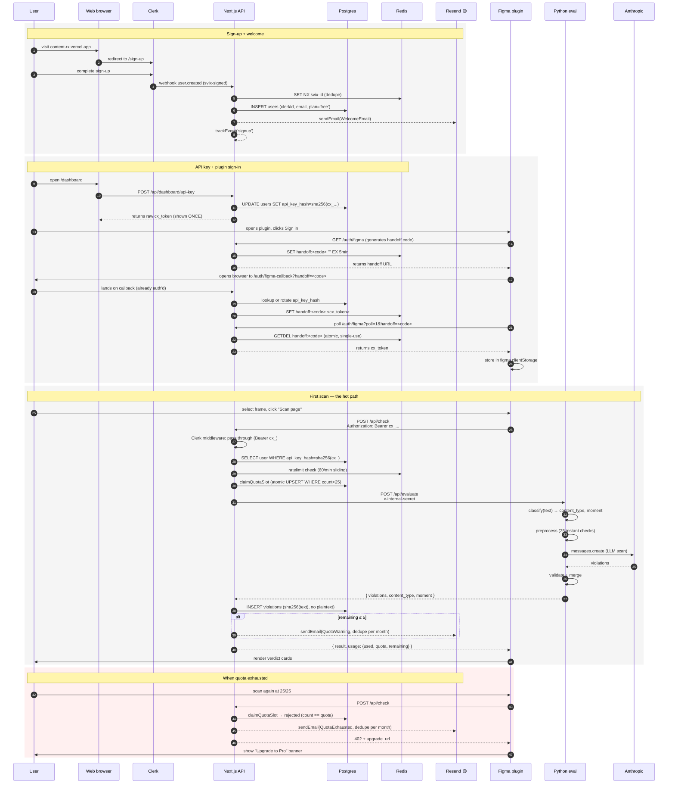
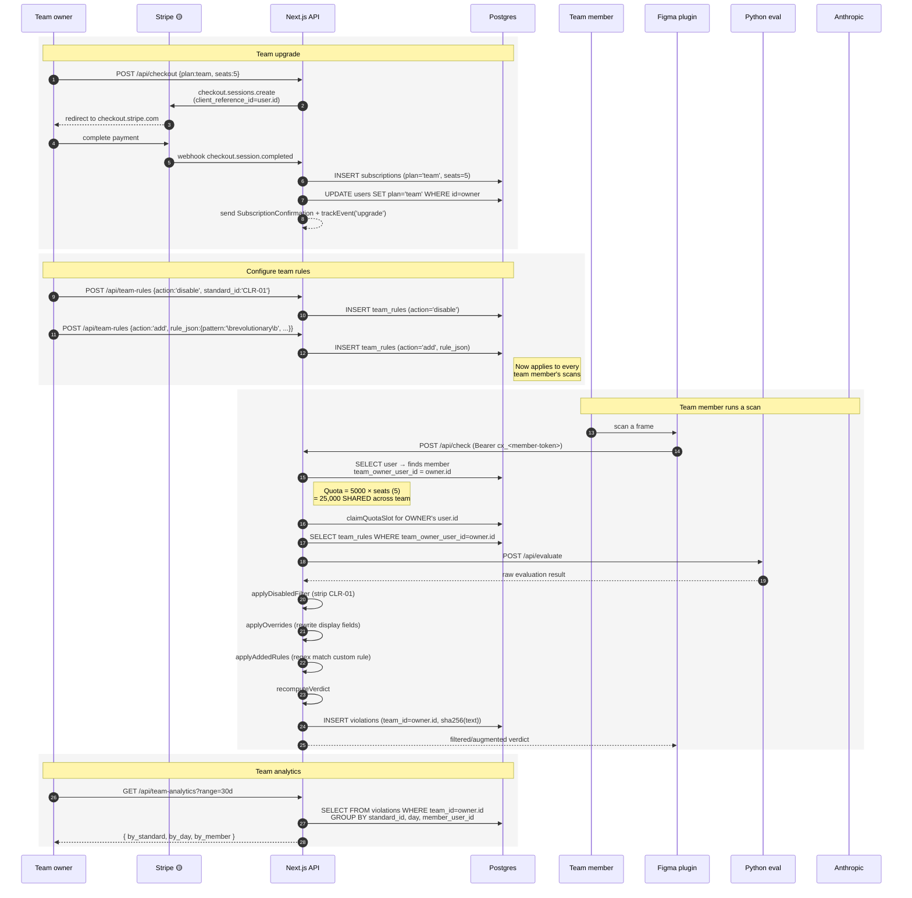

# ContentRX architecture & flows

Snapshot: 2026-04-22, after v1 audit waves 1–3 + Resend/Sentry/Plausible wiring + docs-site scaffold + npm audit/vercelignore hotfixes.

**Plan source of truth**: [BUILD_PLAN_v2.md](../BUILD_PLAN_v2.md). The
diagrams below show the *current* deployed state plus the surfaces v2
adds (MCP server in Phase 1, LSP server in Phase 5, public accuracy
page in Phase 4, public content-model spec in Phase 6).

## Legend

- 🟢 **Live in prod and working** — code shipped, env vars set, end-to-end functional
- 🟡 **Code-ready, inert** — code merged + deployed, but waiting on you to provision env vars / external accounts
- 🔴 **Future (v2)** — not started; named v2 phase / session indicates when it lands

---

## 1. System architecture — services + integrations

```mermaid
graph TB
    subgraph "Client surfaces"
        MCP["MCP server 🔴<br/>(uvx contentrx-mcp)<br/>v2 Phase 1 — THE reposition<br/>Claude Code · Cursor · Claude desktop"]
        LSP["LSP server 🔴<br/>(uvx contentrx-lsp)<br/>v2 Phase 5<br/>VS Code · Cursor · Zed · Neovim"]
        GHA["GitHub Action 🟡<br/>(github-action/, in-tree)<br/>v2 Phase 2: Marketplace publish<br/>engineers on PRs"]
        CLI["CLI client 🟢<br/>(contentrx-cli on PyPI)<br/>engineers in terminals + CI"]
        FP["Figma Plugin 🟢<br/>(figma-plugin/ui.html)<br/>designers + PMs"]
        WEB["Web browser 🟢<br/>(landing + dashboard)<br/>admins"]
        DOC["docs.contentrx.app 🟡<br/>(docs-site/, in-tree)<br/>v2 Phase 6: separate Vercel project"]
    end

    subgraph "Vercel — content-rx.vercel.app"
        MW["Clerk Middleware<br/>(src/middleware.ts)"]
        NXT["Next.js API routes<br/>/api/check, /api/checkout,<br/>/api/portal, /api/team-rules,<br/>/api/team-analytics, /api/dashboard/*,<br/>/api/webhooks/clerk, /api/webhooks/stripe<br/>🟢"]
        PY["Python eval function<br/>api/evaluate.py<br/>🟢 internal only<br/>(gated by INTERNAL_EVAL_SECRET)"]
    end

    subgraph "Data layer"
        PG[("Supabase Postgres<br/>users, usage, subscriptions,<br/>team_members, team_rules,<br/>violations, ditto_syncs<br/>via Drizzle ORM<br/>🟢")]
        RDS[("Upstash Redis<br/>rate limit · webhook dedupe ·<br/>email dedupe · figma handoff<br/>🟢")]
    end

    subgraph "External services — 🟢 live"
        CK["Clerk v7<br/>(test keys in prod ⚠)"]
        AN["Anthropic API<br/>(LLM evaluator)"]
    end

    subgraph "External services — 🟡 wired, awaiting env vars"
        ST["Stripe<br/>(products + webhook +<br/>6 env vars TODO)"]
        RS["Resend<br/>(API key + verify<br/>hello@contentrx.app)"]
        SN["Sentry<br/>(DSN + auth token<br/>+ org/project)"]
        PL["Plausible<br/>(register site +<br/>NEXT_PUBLIC_PLAUSIBLE_DOMAIN)"]
    end

    subgraph "Future surfaces (v2)"
        ACC["Accuracy page 🔴<br/>contentrx.app/accuracy<br/>v2 Session 15"]
        SPEC["Public content-model spec 🔴<br/>github.com/contentrx/content-model<br/>v2 Session 20 (CC-BY 4.0)"]
        VSC["VS Code + Cursor extensions 🔴<br/>v2 Session 18 (LSP launchers)"]
    end

    %% Client → Vercel
    MCP -. "POST /api/check<br/>Bearer cx_<token>" .-> MW
    LSP -. "POST /api/check<br/>Bearer cx_<token>" .-> MW
    FP -- "POST /api/check<br/>Bearer cx_<token>" --> MW
    CLI -- "POST /api/check<br/>Bearer cx_<token>" --> MW
    GHA -- "POST /api/check<br/>Bearer cx_<token>" --> MW
    WEB -- "Cookies (Clerk session)" --> MW
    MW -- "auth.protect() OR<br/>pass through if Bearer cx_" --> NXT
    VSC -. "spawns" .-> LSP

    %% Vercel internals
    NXT -- "POST /api/evaluate<br/>x-internal-secret" --> PY
    NXT -- "Drizzle queries" --> PG
    NXT -- "GET/SET/GETDEL" --> RDS
    PY -- "messages.create" --> AN

    %% Auth
    NXT -- "auth() / clerkClient()" --> CK
    CK -. "user.created/updated/deleted<br/>webhook" .-> NXT

    %% Billing
    NXT -- "checkout.sessions.create<br/>billingPortal.sessions.create" --> ST
    ST -. "checkout.session.completed<br/>customer.subscription.*<br/>invoice.payment_failed" .-> NXT

    %% Email
    NXT -- "resend.emails.send" --> RS

    %% Analytics
    NXT -- "trackEvent (server)" --> PL
    WEB -- "pageview script" --> PL

    %% Errors
    NXT -- "captureException" --> SN
    WEB -- "captureException + replays" --> SN

    %% Docs site
    DOC -. "reads<br/>standards_library.json<br/>at build time" .-> PG

    %% Future links
    WEB -. "links to" .-> ACC
    DOC -. "reads pinned spec" .-> SPEC

    classDef live fill:#d1fae5,stroke:#059669,color:#065f46
    classDef inert fill:#fef3c7,stroke:#d97706,color:#92400e
    classDef future fill:#fee2e2,stroke:#dc2626,color:#991b1b
    classDef vercel fill:#e5e7eb,stroke:#374151,color:#1f2937

    class FP,CLI,WEB,PG,RDS,CK,AN,NXT,PY live
    class GHA,DOC,ST,RS,SN,PL inert
    class MCP,LSP,ACC,SPEC,VSC future
    class MW vercel
```

> **About the dashed edges to MCP / LSP / VS Code-Cursor**: those
> surfaces don't exist in code yet. The dashed lines show what their
> request shape *will* be when v2 Phases 1 + 5 land — same `/api/check`
> hot path, same `Bearer cx_<token>` auth. Per the v2 banned-shortcuts
> rule "no new surfaces that bypass the engine," every future surface
> calls into the same single source of truth.

---

## 2. Flow — individual (Free) user, sign-up → first scan

What happens when a brand new user signs up and runs their first scan from the Figma plugin.

---

## 3. Flow — Team-tier customer, shared quota + custom rules

What changes once an admin upgrades to Team and configures rules.

---

## 4. What's blocking which flow

If you treat each flow above as a "real product moment" the user has to land, here's what gates each one right now:

| Flow / moment | Blocked on |
|---|---|
| Sign-up + welcome email arrives | Resend API key + verified `hello@contentrx.app` domain |
| Sign-up registers as Plausible goal | `NEXT_PUBLIC_PLAUSIBLE_DOMAIN` set in Vercel env |
| Server crashes show in Sentry | `SENTRY_DSN` + 4 other Sentry env vars in Vercel env |
| First scan from plugin → result back | ✅ already works in prod (Anthropic key is set) |
| Quota warning + exhausted emails | Resend (same as welcome) |
| Upgrade to Pro / Team | Stripe products + webhook + 6 env vars |
| Subscription confirmation email | Stripe ✅ + Resend |
| Team invite + invite acceptance | Invite flow not built (no PR exists yet) |
| Team rules + analytics | ✅ already works |
| CLI auth + scan | ✅ ships on PyPI; user pastes cx_token from dashboard |
| GitHub Action posts PR comments | Action needs to be split to its own public repo + Marketplace publish |
| Real users (not Clerk test instance) | Clerk live keys (`pk_live_...` / `sk_live_...`) + new webhook secret |
| docs.contentrx.app | New Vercel project, `Root directory: docs-site/`, bind domain |
| Ditto integration | Was v1 Session 18 — **dropped from v2** (not in BUILD_PLAN_v2 phases). Was always blocked on a Ditto API account. |

---

## 5. Suggested order to unblock

Roughly cheapest → most setup work, and prerequisites first:

1. **Plausible** (5 min) — register site, set 1 env var. Frees up signup/upgrade event tracking.
2. **Sentry** (15 min) — create project, set 5 env vars. Critical *before* live traffic.
3. **Resend** (30 min — DNS waits) — verify `hello@contentrx.app`, set 1 env var. Unlocks all 4 active email templates.
4. **Stripe** (1–2 hr) — create 4 products, configure webhook, set 6 env vars. Unlocks payments + subscription email + Team flow.
5. **Clerk live keys** (30 min) — production instance + new webhook. Switches off the test publishable key.
6. **docs-site Vercel project** (15 min) — second Vercel project, root = docs-site/. Goes live.
7. **GitHub Action repo split + Marketplace** (longer) — separate public repo, publish.
8. **(Ditto integration is no longer in the plan — see v2 doc.)**

This whole order maps to **v2 Session 1** ("Clerk live mode + env provisioning"). It's the Phase 0 floor — every later phase assumes prod has live keys + working observability + working email.

After 1–5 you have a fully working free + paid product. After 6–7 the distribution story is complete.
