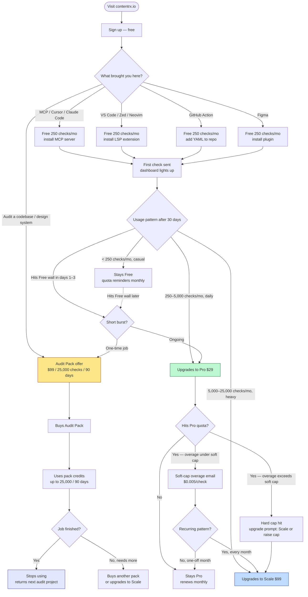

# ContentRX pricing & unit-of-value strategy

**Date:** 2026-04-26
**Status:** Draft for review → ready to fan out into PRDs once approved
**Companions:**
- [`design-critique-2026-04-26.md`](./design-critique-2026-04-26.md) — what's there today
- [`customer-experience-design-2026-04-26.md`](./customer-experience-design-2026-04-26.md) — what the customer journey should become

---

## TL;DR

**Brand promise (locked):** ContentRX — staff-level content design review in every repo, Figma file, or terminal.

**Unit of consumption:** the *check* — one string evaluated by the engine, returning a verdict + suggestion + severity + confidence in under a second.

**Unit of value:** a string you can ship with a senior content designer's blessing — or, when it fails, a string you ship anyway, knowing exactly why a senior content designer would have flagged it. Customers don't fall in love with checks. They fall in love with **shippable copy on demand**.

**The line for the pricing page:**
> $29/month: a senior content designer's verdict on every string you ship — in your repo, your PR, your Figma file, your terminal — without ever leaving the work.

**Pricing structure (proposed for launch):**

| Offer | Price | Checks | Overage | Soft cap default | For |
|---|---|---|---|---|---|
| **Free** | $0 | 250/mo | hard cap | n/a | Trying it out |
| **Pro** | $29/mo | 5,000/mo | $0.005/check | $50 | Daily integration, casual |
| **Scale** | $99/mo | 25,000/mo | $0.003/check | $200 | Daily integration, heavy |
| **Audit Pack** | $99 one-time | 25,000 / valid 90 days | none — credits expire | n/a | Burst projects, no subscription |
| **Team** | TBD | TBD | TBD | TBD | Locked after first 50 paying customers reveal the buying motion |

**Three locked decisions:**
1. **Rename "scans" → "checks" everywhere.** Engine, dashboard, all marketing copy.
2. **Hybrid quota + cheap overage with customer-set soft cap** as the model for Pro and Scale. No surprise bills, no stop-work.
3. **Audit Pack as a first-class one-time offer.** Captures burst usage that doesn't fit a subscription motion.

**Two deliberately deferred decisions:**
1. **Team tier specifics.** Wait for buying-motion signal from the first 50 paying customers. Until then, behave like a Team via domain-detection on Pro (auto-roll same-domain Pro subs into one invoice).
2. **Annual billing & discounts.** Wait for churn data. Monthly only at launch.

---

## The mental model

### The atom and the molecule

```
ATOM                            MOLECULE
─────                           ────────
1 check                  →      1 shippable string
                                with a senior content
                                designer's verdict
```

Customers consume atoms (checks). Customers value molecules (shippable strings). Pricing meters the atom; marketing sells the molecule. Conflating the two — talking about checks in the marketing copy, talking about molecules in the dashboard — is how you confuse customers about what they're buying.

### The stack ContentRX lives in

ContentRX is **the review layer**. That layer didn't have a tool before. The pitch isn't "instead of Claude" or "instead of Ditto" — it's "alongside both, in the gap they leave."

| Layer | Tool today | Job |
|---|---|---|
| Generation | Claude / Cursor / a PM at 11pm | Write the string |
| **Review** | **ContentRX** | **Decide if it's shippable** |
| Storage | Ditto | Hold it as a managed asset |
| Localization | Ditto / Phrase | Translate it |
| Final polish | Grammarly / LanguageTool | Catch the typo |

**Sales conversations:**
- *"I already use Claude."* → Claude writes. ContentRX reviews. You'll use both.
- *"I already use Ditto."* → Ditto stores. ContentRX gates. They stack.
- *"I already use Grammarly."* → Grammarly catches typos. ContentRX catches content-design errors. Different jobs.

---

## The three usage shapes

A customer who runs ContentRX through 19 repos and cancels isn't a *bad* customer — they're a *misclassified* one. They were never going to be a steady-state subscriber; they had an audit job to do. Selling them Pro guarantees they cancel and feel bad about it. Selling them an Audit Pack converts them to a recurring relationship without a recurring subscription, because the *next* audit also costs $99 and you're the only product that does it.

There are three distinct shapes:

| Shape | Who does this | Volume | Cancellation pattern |
|---|---|---|---|
| **Integration light** | PM gating new copy on a few flows/week, designer scanning a few Figma frames/week, engineer with MCP installed | 50–500 checks/week | Sticky — cancels only if they leave the company or stop shipping product |
| **Integration heavy** | Engineer with LSP-on-save running constantly, team gating every PR via the GitHub Action, designer auditing a system at the end of each sprint | 2,000–10,000 checks/week | Sticky — cancels only on team-level decision |
| **Audit burst** | Consultant doing a content audit for a client; new content design lead inheriting a portfolio; engineering org doing a pre-launch sweep | 10,000–50,000 checks in a few days, then nothing | **Cancels by design** — the job is finished |

The current pricing structure has only one offer (Pro at $29 with 5,000) which fits only the *integration light* shape. Heavy integration users hit the wall mid-week and downgrade their usage instead of upgrading their plan. Audit users hit the wall mid-job and cancel angry. Both leave money on the table and create negative word-of-mouth.

The proposed structure has a clear offer for each shape:

```
Integration light  →  Pro $29/mo
Integration heavy  →  Scale $99/mo
Audit burst        →  Audit Pack $99 one-time
```

---

## Customer journey diagram



The diagram surfaces three things worth calling out:

1. **The surface picker is the first post-signup screen.** The picker isn't decoration — it's how you route audit-shaped users away from a Pro subscription they'll cancel and into an Audit Pack they'll come back to.
2. **"ChurnSatisfied" is a goal state, not a failure state.** The audit customer who finishes their job and stops using ContentRX is a happy customer who paid $99 and will pay another $99 next time. Don't try to convert them to Pro.
3. **No path goes to a hard cap on Pro or Scale.** The soft cap mechanism means the only way work stops is when the customer's *configured* ceiling is hit — not your platform's quota.

---

## Pricing decisions, with rationale

### Free — 250 checks/month, hard cap

**What:** 250 checks per month. No overage. No credit card required at signup.

**Why 250 (not 25, not 1,000):**
- 25 (current) is too few. The Figma plugin sends one /api/check call per text node — a single typical frame is 5–50 nodes, so a designer hits the wall *mid-frame* on their first scan. The free tier becomes a paywall in the middle of the demo.
- 1,000 is enough for a small team to ship product on without paying. That's not freemium — that's free.
- 250 is enough for ~5 Figma frames OR a week of moderate MCP usage OR ~20 small PRs. Enough to fall in love with; not enough to ship a product on.

**Why hard cap (no overage):** Free customers are not yet committed to the product. Letting them burn unlimited checks they then refuse to pay for is unbounded LLM cost on your side. A hard cap forces the upgrade conversation, which is how you find out who's actually a customer.

**Renews:** monthly, on the 1st (UTC), via the existing `currentMonth()` logic.

### Pro — $29/month, 5,000 checks, soft-capped overage

**What:** $29/month. 5,000 checks/month included. Overage at $0.005/check above quota, up to a customer-configured soft cap (default $50/month). When the soft cap is hit, work stops with an upgrade prompt — *not* a silent bill increase.

**Why $29 (not $19, not $49, not $99):**
- $29 sits below corporate-card no-approval thresholds at every series-B-and-above company I'm aware of. PMs can expense it without procurement.
- $29 is the high end of the AI-tool anchor band (Cursor $20, Claude $20, Copilot $19, Grammarly $12, Frase $39). The named-expert positioning earns the right to sit at the top of the band, not above it.
- Pushing higher creates a procurement conversation. The launch goal is *avoiding* procurement conversations, not winning them.

**Why 5,000 checks:** Roughly 167 checks/business-day. A daily-integration user (LSP-on-save excluded) won't hit it. Heavy users will, which is the bridge to Scale.

**Why $0.005/check overage:** Approximately matches LLM cost (Sonnet at typical token volume is ~$0.002–0.004/check). Margin-positive but not extractive. At $0.005, an additional 1,000 checks costs $5 — a number nobody flinches at.

**Why soft cap default $50:** Caps the customer's downside at "this still feels like a $79 month." Configurable at signup; configurable at any time in the dashboard. Upgrading to Scale becomes attractive at three consecutive months over the cap.

### Scale — $99/month, 25,000 checks, soft-capped overage

**What:** $99/month. 25,000 checks/month included. Overage at $0.003/check (volume discount vs. Pro), up to a customer-configured soft cap (default $200/month).

**Why $99:** Three reasons:
- Heavy integration users (LSP-on-save, every-PR CI, large-frame Figma audits) generate 8,000–20,000 checks/month easily. Pro at $29 + overage feels like nickel-and-diming for these users; they want a "I bought enough" feeling. $99 delivers that.
- $99 is the threshold where small teams will *ask procurement* about it, but it's still self-serve-able at most companies. Above $100 the procurement question gets harder.
- 3.4× the Pro price for 5× the included checks is the expected volume-discount shape. Customers reading the pricing page do that math instinctively.

**Why a separate tier (not just bigger overage):** A customer paying $50/month in overage on Pro is a customer who *should be on Scale*. They're paying $79 for what they could pay $99 for and never think about quota again. Surfacing Scale as a clear upgrade saves them the mental load and saves you the support load of "why is my bill $79 again."

**Auto-promote prompt:** If a Pro user pays overage in 2 of 3 months, the dashboard surfaces a one-click "Upgrade to Scale and save" CTA. Don't auto-upgrade silently — but make the math obvious.

### Audit Pack — $99 one-time, 25,000 checks valid 90 days

**What:** A one-time purchase of 25,000 checks that don't expire for 90 days. No subscription. No recurring billing.

**Why this exists:** Per the three-usage-shapes table, audit customers cancel by design. Selling them a subscription is selling them a thing they will refuse to keep. Selling them a credit pack matches their actual mental model: *"I have a project. I need a tool. I'll pay for the project."*

**Who buys this:**
- Consultants doing content audits for clients. Buys 4–8 packs/year, one per engagement. **High lifetime value, zero subscription overhead.**
- New content design leads inheriting a portfolio. Buys one in their first month to assess what they've inherited.
- Engineering orgs doing a pre-launch sweep. Buys one per major launch.
- Curious developers who want to scan their entire monorepo once for fun. Buys one, becomes an advocate.

**Why $99 (same as Scale):** Anchors against the monthly Scale price. Customer math: *"$99 either gets me 25,000 checks for one project, or 25,000 checks every month forever — same number, my choice."* That's a clarifying frame.

**Why 90 days (not 30, not 12 months):**
- 30 is too short — a real audit project takes 4–8 weeks; if the customer hits the deadline mid-audit they feel cheated.
- 12 months is too long — credits don't generate behavior; expiry creates urgency.
- 90 days spans a quarter, which matches how most teams plan.

**Stacks with subscription:** A Pro or Scale customer can buy an Audit Pack in addition. Pack credits draw down first; subscription quota draws down second. (See "Dashboard implications" below.)

**Repeat-purchase nudge:** When a customer's pack is 80% consumed, email: *"Your pack is almost done. Buy another? Or move to Scale?"*

### Team — deferred until first 50 paying customers

**What:** No Team tier in the launch SKU lineup. Until the buying motion clarifies (see [`customer-experience-design-2026-04-26.md`](./customer-experience-design-2026-04-26.md) §3), team behavior is delivered via two patterns:

1. **Domain-based grouping.** When 3+ users from the same email domain are on Pro or Scale, the dashboard rolls them into one invoice and surfaces team-level views (overrides by member, top standards firing across the team, etc.). No purchase decision required.
2. **One admin per domain.** The first user from a given domain becomes the implicit admin and can configure team rules. (Today's `team_owner_user_id` model can absorb this with minimal schema change.)

**When to ship a real Team tier:** When the first 50 paying customers reveal which of the four buying motions (a self-serve PM / b bottom-up team / c champion-led / d design-leader top-down — per the acquisition brief) is dominant. Each motion implies a different Team-tier shape:

| Dominant motion | Implies Team tier shape |
|---|---|
| Self-serve PM | Don't build a Team tier yet; let domain-grouping carry the load |
| Bottom-up team | Per-seat pricing with admin features at $49–$59/seat |
| Champion-led | Annual contract with 10–25 seats baked in, ~$2.5k–$5k ACV |
| Design-leader top-down | Org-wide license with usage-based overage, ~$10k+ ACV |

**Don't price the Team tier from hypothesis. Price it from data.**

### Why no annual yet

Annual discounts price churn. You don't have churn data. Discounting blindly trains customers that the monthly price is the inflated price. Wait three months, look at month-2 and month-3 retention by tier, then decide.

If you must offer something annual at launch for the procurement-conscious buyer, offer it on **Scale only** at "save one month — $1,089 vs $1,188" (≈8% discount, monthly-feel pricing). Don't discount Pro annually; the overage mechanism on Pro already spreads cost.

### Why no enterprise tier

You don't have:
- SSO (SAML/Okta)
- An MSA template a procurement officer will accept without revising
- A DPA (data processing agreement)
- An SLA you can defend
- Customer support staffing for an enterprise expectation

Putting "contact sales →" on the pricing page when you can't actually fulfill an enterprise sale is worse than not having the tier at all. It tells procurement-trained buyers you're not ready for them. **Add enterprise the week after the first inbound enterprise lead clears $1,000/mo on Scale.**

---

## What this means for engineering

### Stripe — what to build

Stripe Metered Billing is the primitive. The architecture:

1. **Two products in Stripe:**
   - `contentrx_pro` — recurring monthly, $29 base
   - `contentrx_scale` — recurring monthly, $99 base
   - `contentrx_audit_pack` — one-time invoice item, $99 (no recurrence)

2. **One metered usage record per check.** Implemented in `/api/check/route.ts` after the existing `claimQuotaSlot` succeeds. Send a usage record to Stripe with the customer ID, the check ID (idempotency key), and the timestamp. Stripe handles aggregation.

3. **Two metered prices per subscription:**
   - Included quota — flat `$29` or `$99` for first 5,000 / 25,000 (Stripe's `tiered` pricing with `up_to: 5000` at $0)
   - Overage — `$0.005` or `$0.003` per check above the included quota

4. **Soft cap enforcement at the application layer, not Stripe.** Stripe doesn't natively support customer-set spend caps on metered billing. The pattern:
   - Customer sets soft cap in dashboard. Persisted on `subscriptions.softCapUsd`.
   - On each `/api/check` call, after the quota claim, compute the projected month-end overage cost. If `projected > softCap`, reject the call with `402 Soft cap reached` and an upgrade CTA.
   - Email the customer when they cross 80% of their soft cap.
   - Customer can raise the cap from the dashboard at any time, instantly unblocking new calls.

5. **Audit Pack as one-time invoice + custom credit balance.** Stripe doesn't natively support credit packs that count down. Implementation:
   - On purchase, create a one-time invoice item in Stripe.
   - On payment success (webhook), insert a row in a new `credit_packs` table: `(user_id, purchased_at, credits_total, credits_used, expires_at)`.
   - In `/api/check`, before the subscription quota claim, check for active pack credits. If any, deduct from pack first; only fall back to subscription quota when pack is empty.
   - Email at 80% pack consumption with a "buy another pack" CTA.
   - Email at expiry – 7 days with a "use it or lose it" CTA.

6. **Domain-grouping team discount.** When the 3rd Pro/Scale subscription with the same email domain activates, automatically apply a "team domain" coupon (10% off all subs in the group) and consolidate billing to whichever subscription was first. Webhook on `customer.subscription.created` triggers the domain check.

### Schema changes

Three new columns and one new table on top of the existing `subscriptions`, `users`, `usage`:

```ts
// src/db/schema.ts — proposed additions

subscriptions: {
  // existing columns...
  softCapUsd: integer('soft_cap_usd').notNull().default(50),  // Pro default
  pricingTier: text('pricing_tier', {
    enum: ['free', 'pro', 'scale', 'team']
  }).notNull().default('free'),
  domainGroupId: text('domain_group_id'),  // for team-via-domain rollup
}

// New table
creditPacks: {
  id: text('id').primaryKey(),
  userId: text('user_id').notNull().references(() => users.id),
  stripeInvoiceItemId: text('stripe_invoice_item_id').notNull(),
  creditsTotal: integer('credits_total').notNull(),
  creditsUsed: integer('credits_used').notNull().default(0),
  purchasedAt: timestamp('purchased_at').notNull(),
  expiresAt: timestamp('expires_at').notNull(),
}

// New table for soft-cap state (could be derived from Stripe usage records,
// but caching in our DB keeps the hot path fast)
overageState: {
  userId: text('user_id').notNull(),
  month: text('month').notNull(),  // 'YYYY-MM'
  overageChecks: integer('overage_checks').notNull().default(0),
  overageUsdCents: integer('overage_usd_cents').notNull().default(0),
}
```

### `/api/check` flow changes

The current 9-step flow ([per CLAUDE.md](./CLAUDE.md)) needs three insertions:

```
 1. Auth
 2. Load team rules
+2.5. Check active pack credits — if any, mark this call as "pack-funded"
 3. Check monthly quota — but only if not pack-funded; otherwise skip
+3.5. If not pack-funded and quota exhausted, check overage soft cap
+     If projected overage cost > soft cap, return 402 with upgrade CTA
 4. Rate limit
 5. Custom-example short-circuit (existing)
 6. Call /api/evaluate
 7. Apply team rule filters
 8. Log violation (sha256 only)
 9. Increment usage counter (or pack.creditsUsed if pack-funded)
+9.5. Send Stripe metered usage record (subscription path only)
10. Return result + new metadata: { source_balance: 'pack'|'subscription', remaining: N }
```

The `source_balance` field in the response tells the dashboard which bucket the call drew from, which the dashboard uses to render two balances simultaneously (see UX section below).

---

## What this means for the dashboard

The dashboard reorganization from [`customer-experience-design-2026-04-26.md`](./customer-experience-design-2026-04-26.md) is the foundation. On top of that, the new pricing model adds three new patterns:

### 1. Two balances, side by side, when both exist

For a Pro customer with no pack: one usage card showing subscription quota.

For a Free customer who bought a pack: one usage card showing pack credits with expiry date.

For a Pro customer who *also* bought an audit pack (which happens when, e.g., a steady-state Pro user gets a new audit project): **two cards**, side by side, with explicit labels:

```
┌──────────────────────────────┐  ┌──────────────────────────────┐
│ Audit Pack credits           │  │ Pro subscription this month  │
│ ▰▰▰▰▰▱▱▱▱▱  47% used         │  │ ▰▰▰▱▱▱▱▱▱▱  31% used         │
│ 13,247 / 25,000 remaining    │  │ 1,540 / 5,000 remaining      │
│ Expires May 22               │  │ Renews May 1                 │
│ [Buy another pack]           │  │ [Manage subscription]        │
└──────────────────────────────┘  └──────────────────────────────┘
```

The visual language must make clear that **pack credits are spent first**. Otherwise customers will worry the pack is being wasted.

### 2. Pre-action dry-run pattern, everywhere

Every surface that can run more than ~10 checks at once needs a pre-action confirmation. The pattern:

```
$ contentrx scan ./src
Scanning ./src for translatable strings...
Found 1,247 strings across 184 files.

This will consume 1,247 checks.
  Audit pack remaining: 13,247 ✓ (will use 1,247)
  Pro subscription will not be touched.

Estimated time: ~6 minutes.

Run all 1,247 checks? [y/N]
```

Same pattern in:
- **Figma plugin:** modal before "Scan page" — *"Scan page → 312 strings detected. Use 312 checks? [Cancel] [Scan]"*
- **GitHub Action:** YAML config takes a `max-checks` per PR with sensible default (200). Above the cap, fail-soft with a comment: *"PR exceeds max-checks. Scanned first 200 strings. To scan all 487, increase `max-checks` in workflow config or use Scale tier."*
- **MCP:** the LLM client narrates the projected check count when calling `evaluate_copy_batch`. Single-string `evaluate_copy` doesn't need the gate.

This single pattern eliminates the "I burned my quota" support ticket category.

### 3. Soft-cap configuration UI

A small section on `/dashboard` (or a dedicated `/dashboard/billing` page):

```
Overage protection
─────────────────────
Pause all checks when this month's overage charges reach:

  $[ 50 ] / month  (about 10,000 extra checks at $0.005 each)

Email me at:
  [x] 80% of cap
  [x] 100% of cap

[Save]
```

When 100% of cap is hit, all subsequent calls return 402 with this body:

```json
{
  "error": "Soft cap reached",
  "soft_cap_usd": 50,
  "overage_so_far_usd": 50.00,
  "options": [
    { "action": "raise_cap", "url": "/dashboard/billing" },
    { "action": "upgrade_to_scale", "url": "/dashboard/upgrade" },
    { "action": "buy_audit_pack", "url": "/dashboard/billing/pack" }
  ]
}
```

Surfaces (CLI, MCP, etc.) translate this into a friendly prompt.

### 4. Tier upgrade nudges, but only when the math says so

Don't badge every Pro user with "Upgrade to Scale!" — that's noise that customers learn to ignore. Surface the upgrade nudge only when:

- A Pro user paid overage in 2 of the last 3 months (hard signal that Scale would have saved them money)
- A Pro user is projected to exceed quota by 30%+ this month, with two weeks remaining
- A Free user hits their quota in <14 days

The nudge copy is concrete: *"Last month you paid $43 in overage. Scale would have cost $99 with 17,000 checks to spare."* Numbers, not adjectives.

---

## Migration plan

ContentRX has zero paying customers at the time of this pivot ([per CLAUDE.md](./CLAUDE.md): *"the schema 2.0.0 cutover lands atomically… ContentRX has zero paying customers at the time of the bump"*). This makes the migration trivial:

1. **Update `quotas.ts`:** `free: 25 → 250`. Pro stays 5000. Add `scale: 25000`. Remove the per-seat semantics for now (no Team plan at launch).
2. **Add `pricing_tier` enum to `subscriptions`** with Drizzle migration. Backfill existing rows (if any) to `'free'`.
3. **Update `/api/check` handler** to use `pricing_tier` for quota lookup and overage calc.
4. **Wire Stripe products** (`contentrx_pro_v2`, `contentrx_scale_v1`, `contentrx_audit_pack_v1`).
5. **Update the dashboard** to render the new tier names, the soft-cap UI, and the two-balance pattern.
6. **Update the marketing copy** — landing page, install page, future `/pricing` page — to use "checks" not "scans" and to communicate the new offers.
7. **Ship the surface picker** as the first post-signup screen.

If any signups have happened by the time this ships, grandfather them into a 30-day Pro trial regardless of tier so the first cohort doesn't churn on the price change.

---

## PRD-ready work items

Each row below is a distinct PRD/issue scoped to one engineering pair-week or smaller. Rough sequencing — adjust for parallelization.

### Phase 1: rename + restructure (week 1)

| ID | Title | Description | Surface |
|---|---|---|---|
| PR-01 | Rename "scans" → "checks" globally | Find/replace across UI, marketing, docs, and the dashboard. No engine changes. Snapshot tests update. | All |
| PR-02 | Bump Free quota 25 → 250 | One-line change in `quotas.ts`. Update copy that references "25." | Engine |
| PR-03 | Add `pricing_tier` to schema | Drizzle migration, default `'free'`. Backfill any existing rows. | DB |
| PR-04 | Build `/pricing` page | Public marketing page with the four offers, the unit-of-value framing, CTAs into Stripe Checkout. | Marketing |
| PR-05 | Add Scale tier to Stripe + checkout | Stripe product, price, checkout flow, webhook handler for subscription events. | Stripe |
| PR-06 | Add Audit Pack to Stripe + checkout | One-time invoice item, webhook to insert credit pack row, email on purchase. | Stripe |

### Phase 2: usage and metering (week 2)

| ID | Title | Description | Surface |
|---|---|---|---|
| PR-07 | Stripe Metered Billing per-check usage records | Send metered usage to Stripe on each successful `/api/check`. Idempotency on check ID. | Engine |
| PR-08 | Credit pack consumption logic | Insert pack-credits-first logic in `/api/check`. New `credit_packs` table. | Engine |
| PR-09 | Soft-cap enforcement | `softCapUsd` column on `subscriptions`. Pre-call projection check. 402 response with upgrade options. | Engine |
| PR-10 | Soft-cap configuration UI | Dashboard form to set / change the soft cap. Email on 80%/100% triggers. | Dashboard |
| PR-11 | Two-balance dashboard rendering | Side-by-side cards when both pack and subscription exist. | Dashboard |

### Phase 3: pre-action gates (week 3)

| ID | Title | Description | Surface |
|---|---|---|---|
| PR-12 | Figma plugin pre-scan modal | "Scan this frame → N checks. Continue?" before any batch scan. | Figma |
| PR-13 | CLI `--dry-run` and default confirmation | `contentrx scan` shows count + asks for y/N. `--yes` bypasses. | CLI |
| PR-14 | GitHub Action `max-checks` config | YAML input. Above cap, scan first N strings + comment with upgrade nudge. | Action |
| PR-15 | MCP batch evaluation narration | When `evaluate_copy_batch` is called with > 10 strings, return a "this will use N checks" narration before executing. | MCP |

### Phase 4: dashboard reorganization (week 4)

| ID | Title | Description | Surface |
|---|---|---|---|
| PR-16 | Dashboard hero: try-a-check inline | Promote `/dashboard/explain` to inline panel at top of `/dashboard`. | Dashboard |
| PR-17 | Active surfaces row | Cards per surface (MCP / LSP / Action / Figma) with last-call timestamp + this-month count. | Dashboard |
| PR-18 | Surface picker as post-signup screen | Five large cards: MCP / LSP / CLI / GitHub Action / Figma + audit-shaped sixth option. Routes to tailored install. | Onboarding |
| PR-19 | Insights panel: top standards firing, override patterns | "This week: top 3 standards firing, most-overridden, week-over-week change." | Dashboard |
| PR-20 | Tier-upgrade smart nudges | Logic + UI for: "paid overage 2 of 3 months → upgrade to Scale" prompt. | Dashboard |

### Phase 5: domain-team patterns (week 5)

| ID | Title | Description | Surface |
|---|---|---|---|
| PR-21 | Domain-group detection on subscription create | Webhook handler that groups same-domain subs and applies team-domain coupon at 3+. | Stripe + Engine |
| PR-22 | Team-domain dashboard view | Aggregate "your team this week" stats for users in the same domain group. | Dashboard |
| PR-23 | Implicit-admin promotion | First-domain-user becomes admin; can configure team rules without explicit team purchase. | Engine + Dashboard |

### Phase 6: emails and lifecycle (week 6 — can be parallelized with earlier phases)

| ID | Title | Description | Surface |
|---|---|---|---|
| PR-24 | Welcome email with API key + tailored install | Resend-powered, branched by surface picker choice. | Email |
| PR-25 | Quota threshold emails | 50%, 80%, 100% of subscription quota. Configurable. | Email |
| PR-26 | Overage threshold emails | 80%, 100% of soft cap. | Email |
| PR-27 | Pack consumption + expiry emails | 80% consumed, 7 days to expiry, expired. | Email |
| PR-28 | Tier-upgrade smart-nudge emails | Match dashboard nudges with email versions. | Email |

---

## Open questions (need data or customer dev to answer)

| # | Question | How to find out | Decision blocked? |
|---|---|---|---|
| 1 | What % of PMs at series-B+ companies can expense $29 with no approval? | Beta sign-up form question + 10 customer-dev calls in launch week | No — $29 is conservative regardless |
| 2 | What's the average checks-per-Figma-frame across real-world frames? | Telemetry on the existing Figma plugin (no PII — just frame size buckets) | No — but informs Free quota tuning |
| 3 | What's the LSP-on-save check rate per active editing hour? | Telemetry from beta LSP users | No — but informs Scale quota tuning |
| 4 | What's the typical audit project size (checks) for the consultant persona? | Customer-dev calls during launch + Audit Pack purchase telemetry | No — but informs whether 25,000 / 90 days is right |
| 5 | Which buying motion (a/b/c/d) is dominant in the first 50 paying customers? | Cohort analysis at customer #50 | **Yes — blocks Team tier design** |
| 6 | What's the right price elasticity from Pro→Scale? | Pricing test at customer #100 (raise Scale to $129 for new signups, measure conversion) | No — $99 is a defensible launch price |
| 7 | Is there a "Pro Plus" tier between Pro and Scale that captures users who want more than 5,000 but less than 25,000 cleanly? | Watch for cluster of users settling at ~10,000–15,000 checks/month after first cohort | No — overage covers this for now |
| 8 | What % of audit-pack buyers convert to a Scale subscription within 6 months? | Lifecycle analysis at month 6 | No — informs whether to bundle audit + Scale |

---

## Decision log

### Locked

- **Brand promise:** "Staff-level content design review in every repo, Figma file, or terminal."
- **Unit of consumption:** the *check* — one string evaluated.
- **Unit of value:** a shippable string with a senior content designer's verdict.
- **Pricing structure for launch:** Free $0 / Pro $29 / Scale $99 / Audit Pack $99 one-time.
- **Free quota:** 250/mo, hard cap.
- **Pro quota:** 5,000/mo, $0.005 overage, $50 default soft cap.
- **Scale quota:** 25,000/mo, $0.003 overage, $200 default soft cap.
- **Audit Pack:** $99 for 25,000 checks valid 90 days.
- **No Team tier at launch.** Domain-grouping carries the load.
- **No annual billing at launch.**
- **No enterprise tier at launch.**
- **Surface picker as the first post-signup screen.**
- **Pre-action dry-run gate everywhere multi-check actions exist.**

### Hypothesized — revisit at customer #50

- The dominant buying motion is (b) bottom-up team adoption (mid-confidence). If wrong, Team-tier design changes accordingly.
- $29 is the right price point. If signup→paid conversion is below 8%, test $19 for new signups in cohort A vs. $29 in cohort B.
- 250 free checks is "enough to fall in love." If first-week activation rate is below 60% (defined as: at least one /api/check call within 7 days of signup), test 500.

### Pending data — don't decide before launch

- Annual pricing terms.
- Enterprise tier offering.
- Pro Plus / mid-tier between Pro and Scale.
- Multi-pack discounts (e.g., "buy 3 audit packs for $250").
- Geographic pricing (US/EU vs. emerging markets).

---

## Appendix A: copy for the pricing page

Use as a starting point for the marketing pass.

```
─────────────────────────────────────────────────────
  Pricing

  $29/month: a senior content designer's verdict on
  every string you ship — in your repo, your PR,
  your Figma file, your terminal — without ever
  leaving the work.

  All plans share the same engine, the same
  calibrated reviewer, and the same five surfaces.
  The only difference is how much you use it.
─────────────────────────────────────────────────────

  ┌─────────────┐  ┌─────────────┐  ┌─────────────┐
  │ Free        │  │ Pro         │  │ Scale       │
  │             │  │             │  │             │
  │ $0          │  │ $29 / mo    │  │ $99 / mo    │
  │             │  │             │  │             │
  │ 250 checks  │  │ 5,000 / mo  │  │ 25,000 / mo │
  │ per month   │  │             │  │             │
  │             │  │ Overage     │  │ Overage     │
  │ Hard cap —  │  │ $0.005 /    │  │ $0.003 /    │
  │ no overage  │  │ check, soft │  │ check, soft │
  │             │  │ cap default │  │ cap default │
  │             │  │ $50         │  │ $200        │
  │             │  │             │  │             │
  │ All five    │  │ All five    │  │ All five    │
  │ surfaces    │  │ surfaces    │  │ surfaces    │
  │             │  │             │  │             │
  │ [Start free]│  │ [Start Pro] │  │ [Start Scale│
  │             │  │             │  │  ]          │
  └─────────────┘  └─────────────┘  └─────────────┘

  ─────────────────────────────────────────────────
  Have a one-time project? Skip the subscription.

  ┌──────────────────────────────────────────────┐
  │ Audit Pack — $99                             │
  │                                              │
  │ 25,000 checks. Valid 90 days. No subscription.│
  │                                              │
  │ For codebase audits, design system reviews,  │
  │ or pre-launch content sweeps.                │
  │                                              │
  │ [Buy a pack]                                 │
  └──────────────────────────────────────────────┘
```

---

## Appendix B: messaging matrix

For sales, support, and marketing — what to say in common conversations.

| Conversation | What they say | What you say |
|---|---|---|
| Already has Claude | "I already use Claude for copy" | "Claude writes; ContentRX reviews. You'll use both — Claude to draft, ContentRX to gate before shipping." |
| Already has Ditto | "We use Ditto for our strings" | "Ditto stores, ContentRX reviews. They stack — run ContentRX against your Ditto strings before they sync." |
| Already has Grammarly | "Grammarly catches everything" | "Grammarly catches typos and grammar. ContentRX catches content design errors — error messages that blame the user, destructive confirmations that don't name the consequence, CTAs at the wrong altitude." |
| Pricing too high | "$29 is a lot for a writing tool" | "It's not a writing tool — it's a senior content designer's review on every string. You'd pay $200/hour for the same review from a person; $29/month is 8 minutes of that person's time, applied to every string you ship." |
| Pricing too low / "what's the catch" | "Why is this only $29?" | "Because the model improves every time you use it. $29 buys you the model today; the model gets better as you and the team accumulate overrides. The pricing reflects what you get this month, not what we've invested." |
| Wants enterprise | "We need SSO and a DPA" | "We're shipping enterprise features as customer demand confirms them. Today we're focused on the integration motion. If you want to be first on the enterprise list, here's a form — we'll prioritize features against your specific needs." |
| Worried about quota | "What happens if I hit 5,000 checks?" | "Nothing breaks. You keep working at $0.005 per additional check, up to a soft cap you set. We'll email at 80% of the cap; you can raise it any time. If you're hitting 5,000 every month, Scale at $99 is probably cheaper." |
| Burst use case | "I want to scan our whole codebase once" | "That's the Audit Pack — $99 for 25,000 checks valid 90 days, no subscription. When you're done, you're done." |
